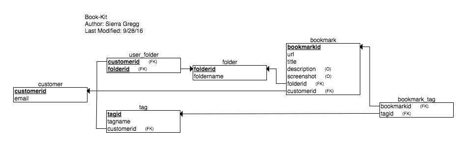

# RESTful API for Book-Kit

## Overview

RESTful API using NodeJS, Express, and Postgres. The API serves information for the Book-Kit project.

## Database

### Schema



## Endpoints

All endpoints use JWT authentication.

### Bookmarks

#### GET /bookmarks

- _Description:_ Returns an array of all the bookmarks associated with an authenticated user. A bookmark record normally consist of an id, url, title, description, a folder id, and a customer id (i.e. the owner/creator of a bookmark). For the connivence of the front-end, the endpoint also returns the folder name, an array of all users with access to the bookmark, and a list of tags. If the user doesn't exit in the database, they are added and an empty array is returned.
- _Endpoint:_ `/bookmarks`
- _Example:_

```json
> GET /bookmarks

Status: 200 OK
[
  { "bookmarkid": 39,
    "url": "https://css-tricks.com/snippets/css/a-guide-to-flexbox/",
    "title": "A Complete Guide to Flexbox",
    "description": "A quick reference Flex.",
    "foldername": "fewd",
    "folderid": 8,
    "screenshot": "https://css-tricks.com/wp-content/uploads/2014/05/flex-container.svg",
    "owner": "12989643",
    "members": ["12989643"],
    "tags": [
      { "tagid": 16,
        "tagname": "reference"
      }
    ]
  }
]
```

#### POST /bookmarks

- _Description:_ Inserts a bookmark into the database and associates it with a folder and tag(s). The bookmark is automatically assigned to the authenticated customer. If insertion into database is successful, then the new bookmark plus tags are returned to the caller.
- _Endpoint:_ `/bookmark`
- _Data Parameters:_ An object with the following fields: url, title, description (optional), folderid, foldername, screenshot (optional), and an array of tags (optional).

- _Example request:_

```json
> POST /bookmark
> {
>   "url": "https://webdesign.tutsplus.com/articles/designing-for-and-as-a-color-blind-person--webdesign-3408",
>   "title": "Designing For, and As, a Color-Blind Person",
>   "description": "Be careful about color combinations.",
>   "screenshot": "https://cdn.tutsplus.com/webdesign/uploads/legacy/articles/003_colorBlind/colortest.png",
>   "folderid": "8",
>   "foldername": "fewd",
>   "tags": ["a11y"]
> }

Status: 201 Created
{
  "url": "https://webdesign.tutsplus.com/articles/designing-for-and-as-a-color-blind-person--webdesign-3408",
  "title": "Designing For, and As, a Color-Blind Person",
  "description": "Be careful about color combinations.",
  "folderid": 8,
  "screenshot": "https://cdn.tutsplus.com/webdesign/uploads/legacy/articles/003_colorBlind/colortest.png",
  "bookmarkid": 40,
  "owner": "123",
  "foldername": "fewd",
  "tags": [
    {
      "tagid": 17,
      "tagname": "a11y"
    }
  ]
}
```

#### PUT /bookmarks/:bookmarkid

- _Description:_ Updates a bookmark and it's associations in the database. If the update is successful, then the edited bookmark is returned to the caller.
- _Endpoint:_ `/bookmarks/:bookmarkid`
- _Data Parameters:_ An object with the following fields: url, title, description (optional), folderid, foldername, screenshot (optional), and an array of tags.
- _Example Request:_

```json
PUT /bookmark/40
{
  "url": "https://webdesign.tutsplus.com/articles/designing-for-and-as-a-color-blind-person--webdesign-3408",
  "title": "Designing For, and As, a Color-Blind Person",
  "description": "Be careful about color combinations.",
  "screenshot": "https://cdn.tutsplus.com/webdesign/uploads/legacy/articles/003_colorBlind/colortest.png",
  "bookmarkid": 40,
  "folderid": "8",
  "foldername": "fewd",
  "tags": ["a11y","color"]
}

Status: 200 Ok
{
  "url": "https://webdesign.tutsplus.com/articles/designing-for-and-as-a-color-blind-person--webdesign-3408",
  "title": "Designing For, and As, a Color-Blind Person",
  "description": "Be careful about color combinations.",
  "folderid": 8,
  "screenshot": "https://cdn.tutsplus.com/webdesign/uploads/legacy/articles/003_colorBlind/colortest.png",
  "bookmarkid": 40,
  "customerid": "123",
  "foldername":"fewd",
  "tags": [
    {
      "tagid": 17,
      "tagname": "a11y"
    },
    {
      "tagid": 18,
      "tagname": "color"
    }
  ]
}
```

#### DELETE /bookmarks/:bookmarkid

- _Description:_ Deletes the bookmark with the specified id. Deleting a bookmark does not remove a tags or folders. If deleting from the database is successful, then the deleted bookmark is returned to the caller.
- _Endpoint:_ `/bookmarks/:bookmarkid`
- _Example Request:_

```json

> DELETE /bookmarks/:bookmarkid

Status: 200 ok
{
  "url": "https://css-tricks.com/snippets/css/a-guide-to-flexbox/",
  "title": "A Complete Guide to Flexbox",
  "description": "A quick reference for Flex.",
  "folderid": 8,
  "screenshot": "https://css-tricks.com/wp-content/uploads/2014/05/flex-container.svg",
  "bookmarkid": 39,
  "customerid": "123"
}
`
```

### Folders

#### GET /folders

- _Description:_ Returns an array of objects containing information about a folder: folderid, foldername, count (i.e. number of customer's associated with a folder), and members (i.e. email addresses of all customers associated with a folder). Folders in the returned array will either be owned by the authenticated customer or be shared with that customer.
- _Endpoint:_ `/folders`
- _Example:_

```json
> GET /folders

Status: 200 OK
[
  {
    "folderid": 8,
    "foldername": "fewd",
    "count": "1",
    "members": ["sierragregg@Gmail.com"]
  }
]
```

### POST /folders

- _Description:_ Creates a new folder and assigns ownership of the folder to the authenticated customer. If insertion into the database is successful, the new folder name and id is returned to the caller.
- _Endpoint:_ `/folders`
- _Data Parameters:_ An object with the following field: foldername.
- _Example request:_

```json
> POST /folders
> {
>   "foldername": "Coding"
> }

Status: 201 Created
{
  "folderid": 9,
  "foldername": "coding"
}
```

#### POST /folders/customers/:folderid

- _Description:_ Allows folders to be shared among multiple customers. Requires a folderid as url param and the customer email in the request body.
- _Endpoint:_ `/folders/customers/:folderid`
- _Data Parameters:_ An object with the following fields: email
- _Example:_

```json
> POST /folders/customers/8
> {
>   "foldername": "456@example.com"
> }

Status: 201 Created
{
  "customerid": "456",
  "folderid": 8
}
```

#### PUT /folders

- _Description:_ Updates a folder's name. If update is successful, then the edited folder is returned to the caller. Only non-shared folders can be edited.
- _Endpoint:_ `/folders`
- _Data Parameters:_ An object with the following fields: foldername
- _Example:_

```json
> PUT /folders/18
> {
>   "foldername": "Javascript"
> }

Status: 201 Created
{
  "folderid": 10,
  "foldername": "Javascript"
}
```

#### DELETE /folder/:folderid

- _Description:_ Attempts to delete the specified folder. Folders can only be deleted if the deleter does not own any bookmarks in the folder. Shared folders are not deleted until the last member has left. If deleting from the database is successful, then the deleted folder is returned to the caller.
- _Endpoint:_ `/folders/:folderid`
- _Example:_

```json
> DELETE /folders/8

Status: 200 Created
{
  "folderid": 9,
  "foldername": "coding"
}
```

### Tags

### GET /tags

- _Description:_ Returns an array of tag objects that the authenticated customer has access to. Each tag object includes tagid, tagname, and an array of bookmarkids associated with the tag. Tags may or many not be connected to a bookmark.
- _Endpoint:_ `/tags`
- _Example:_

```json
> GET /tags

Status: 200 OK
[
  {
    "tagid": 17,
    "tagname": "a11y",
    "bookmarkid": [
      40
    ]
  },
  {
    "tagid": 18,
    "tagname": "color",
    "bookmarkid": [
      40
    ]
  },
  {
    "tagid": 16,
    "tagname": "reference",
    "bookmarkid": [
      null
    ]
  }
]
```

#### POST /tags

- _Description:_ Creates a new tag for a customer. Does not associate it with any bookmarks.
- _Endpoint:_ `/tags`
- _Data Parameters:_ An object with the following fields: tagname
- _Example:_

```json
> PUT /tags
> {
>   "tagname": "Python"
> }

Status: 201 OK
{
  "tagid": 19,
  "tagname": "Python"
}
```

#### PUT /tags/:tagid

- _Description:_ Updates a user's tagname. Only the tag's creator can edit it; if someone besides the owner of the tag tries it will return 0 results.
- _Endpoint:_ `/tags`
- _Data Parameters:_ An object with the following fields: tagname
- _Example:_

```json
> PUT /tags/17
> {
>   "tagname": "accessibility"
> }

Status: 200 OK
{
  "tagid": 17,
  "tagname": "accessibility"
}
```

#### DELETE /tags/:tagid

- _Description:_ Deletes specified tag; will also remove the tag from any associated bookmarks.
- _Endpoint:_ `/tags`
- _Example:_

```json
> DELETE /tags/17

Status: 200 OK
{
  "tagid": 17,
  "customerid": "123",
  "tagname": "accessibility"
}
```
